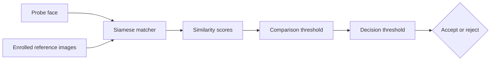

# Siamese Face Verification

A reproducible 1:1 face-verification project for *Introduction to Biometrics*. It trains a Siamese convolutional network, evaluates it with biometric error measures, and provides a small webcam application for live inference. The implementation began with Nicholas Renotte's tutorial and was extended.

This project is split into two parts:
- a notebook for training and evaluating the model,
- a verification app to test the model with live inference.


## Purpose and system overview

Biometric **verification** asks whether a probe belongs to a claimed identity. It differs from identification, which searches for an identity across many enrolled people. Here, both face images pass through the same convolutional embedding network. Their embeddings are compared with an absolute L1 distance layer, and a sigmoid output produces a similarity score from 0 to 1. Higher scores mean “more likely the same person.”

The model is specialized for locally captured people. Genuine training pairs contain two recordings of the same locally captured person; LFW faces are used only as impostors. When several locally captured people are present, cross-person pairs from local captures also teach the model that two enrolled friends are different. During verification, one probe is compared with several references for the claimed identity. Each score is thresholded and the comparison decisions are fused into one transaction-level accept/reject result.



This design follows the supervised metric-learning idea described by Koch, Zemel, and Salakhutdinov [1].

## What changed from the tutorial

Renotte's code and video series [2] are the implementation starting point. This project changes/improves:

- genuine training pairs constructed only from locally recorded identities;
- LFW used only for impostor pairs, with its identities split before sampling so test impostors are absent from the training-impostor pool;
- optional cross-person impostor pairs when recordings for several locally captured people exist;
- held-out, separately captured genuine probes for the practical verification evaluation;
- extended biometric error evauluation: genuine/impostor histograms, FMR, FNMR, DET, EER, d-prime, FAR, FRR, ROC-AUC, confusion counts, and inference latency;
- deterministic sampling, versioned Keras models, pinned dependencies, CPU-safe execution, and Git LFS model delivery;
- compatibility updates for current TensorFlow/Keras, a corrected `2 x 2` first pooling window, and more responsive webcam capture.

The notebook explains each change beside the relevant code.

## Evaluation design

Two levels are reported:

| Level | Unit | Measures | Question answered |
|---|---|---|---|
| Comparison | One probe-reference score | FMR, FNMR, DET, EER, d-prime | How well does the matcher separate genuine and impostor comparisons? |
| Transaction | One fused accept/reject claim | FAR, FRR | How well does the complete threshold-and-fusion policy behave? |

For a higher-is-more-similar score, raising the match threshold usually lowers FMR but raises FNMR. The DET curve exposes this security-usability trade-off across thresholds. EER summarizes the point where FMR and FNMR are approximately equal; it is useful for comparison, but it is not automatically the right operating threshold [5–7].

## Results and interpretation

| Result | Final value |
|---|---:|
| Held-out personalized test ROC-AUC | TBD |
| EER / EER threshold | TBD / TBD |
| d-prime | TBD |
| FMR / FNMR at selected threshold | TBD / TBD |
| Transaction FAR / FRR | TBD / TBD |
| Median / p95 transaction latency | TBD / TBD ms |

Use the following evidence chain for the final interpretation:

1. **Held-out performance:** report test ROC-AUC and the train-test gap. The test uses new captures of the locally captured identities and LFW impostor identities excluded from training; it does not establish genuine matching for people absent from training. Do not treat accuracy at an arbitrary 0.5 threshold as a security guarantee.
2. **Score separation:** compare genuine and impostor centers, overlap, tails, and outliers. Relate these observations to d-prime without assuming the distributions are perfectly Gaussian.
3. **Operating point:** report FMR and FNMR with error counts at the selected threshold. Explain whether the choice prioritizes avoiding impostor matches or avoiding genuine-user rejection. Raising the threshold should reduce the former and increase the latter.
4. **DET and EER:** report EER and its approximate threshold, then explain why the selected operating threshold does or does not differ. EER is a summary, not a deployment recommendation.
5. **End-to-end decision:** report the number of references, both thresholds, fusion rule, FAR, and FRR. Keep these transaction rates distinct from comparison-level FMR/FNMR.
6. **Practicality and limits:** interpret median and p95 latency on the recorded device. Bound all conclusions to the sampled data and configuration.

Suggested final conclusion structure:

> The evaluation contained **TBD genuine** and **TBD impostor** comparisons. At comparison threshold **TBD**, FMR was **TBD (errors/trials)** and FNMR was **TBD (errors/trials)**. The EER of **TBD** and d-prime of **TBD** indicate **TBD about score separation**. After fusing **TBD** reference comparisons, transaction FAR was **TBD** and FRR was **TBD**. Median transaction latency was **TBD ms** on **TBD hardware**. These results support **TBD**, within the limitations below.


- also i changed tshirts/haircut/envrionment&lightning this made it harder so i had record more diverse data

### Limitations

- The locally captured genuine set is small, while impostors come from LFW; camera, crop, and background differences may partly separate the two groups.
- The matcher is specialized for the locally recorded identities. It is not evidence of a general face representation that can verify a completely unseen person without retraining.
- Training, pair-test, and operational LFW impostors use disjoint LFW identity partitions. This prevents LFW identity reuse, but it does not remove the larger capture-source difference between local genuine images and LFW impostors.
- Many comparisons reuse probes or references, so the number of scores is larger than the number of independent people or transactions.
- A measured zero-error rate means only zero observed errors in a finite sample. Always report `errors / trials`; do not infer population-level security.
- The experiment does not establish demographic fairness, presentation-attack resistance, long-term template stability, or production readiness.
- Face detection/alignment failures and multi-person identification are not evaluated.

## Repository layout

```text
notebooks/facial-verification.ipynb  training, evaluation, plots, interpretation
models/                              versioned Keras model files via Git LFS
app/backend/                         FastAPI inference API
app/frontend/                        React webcam interface
data/<person>/verification/          committed reference galleries the app enrolls
data/manual_test/                    staged probe images shown in the app
requirements.txt                     pinned notebook dependencies
requirements.lock.txt                complete reproducible Python environment
```


## Reproduce the notebook

### Prerequisites

- macOS with Python 3.11; the project was pinned with Python **3.11.15**
- Git LFS for the pretrained `.keras` model
- approximately 1 GB free for the LFW download and extraction
- a webcam only if collecting new enrollment/probe images

### Setup
```bash
git lfs install
git clone <HTW-GITLAB-REPOSITORY-URL>
cd biometrics
git lfs pull

pyenv install -s 3.11.15
"$(pyenv root)/versions/3.11.15/bin/python" -m venv .venv
source .venv/bin/activate
python -m pip install --upgrade pip
python -m pip install -r requirements.lock.txt
python -m ipykernel install --user --name biometrics --display-name "Python (biometrics)"
jupyter lab notebooks/facial-verification.ipynb
```

Without pyenv, create `.venv` with an installed Python 3.11 interpreter. In Jupyter or VS Code, select `Python (biometrics)`, keep `TRAIN = False` and `CAPTURE = False`, then run cells in order. The first run downloads LFW through KaggleHub. To record a person, set `PERSON`, enable `CAPTURE`, and collect separate `anchor`, `positive`, and held-out `verification` sets under `data/<person>/`. Every complete folder for a locally captured person is discovered automatically and used for training. LFW is never used for genuine pairs.

Training is optional. Set `TRAIN = True` only when intentionally retraining; a timestamped model will be written under `models/`. Before submission, choose one final model, track it with Git LFS, and report that filename with the final results.

### Optional Apple Silicon GPU

CPU is the reproducible default. GPU support is opt-in:

```bash
source .venv/bin/activate
python -m pip install tensorflow-metal==1.2.0
USE_GPU=1 jupyter lab notebooks/facial-verification.ipynb
```

Restart the kernel after changing device configuration. If Metal fails, restart without `USE_GPU=1`.

## Run the webcam app

The app performs 1:1 verification: pick a **claimed identity**, then present a probe (webcam capture, an uploaded image, or a staged test probe). The probe is scored against that person's reference gallery and fused into one accept/reject.

### Data the app needs

The app reads enrolled people directly from `data/`, which must be present:

```text
data/<person>/verification/*.jpg   reference gallery for each enrolled person
data/manual_test/*.jpg             staged probe images, shown as clickable thumbnails
```

- A person is enrolled automatically when `data/<person>/verification/` holds at least one `.jpg`; the dropdown lists these people. To enroll someone, drop their reference images into that folder.
- `data/manual_test/` holds probe images (e.g. `justin_probe.jpg`, `stranger.jpg`) rendered as a thumbnail grid; click one to verify it against the selected identity.
- Demo galleries and probes for a few people are committed so the app runs out of the box; the rest of `data/` (anchor, positive, LFW) stays git-ignored. Run `git lfs pull` for the model.
- `GALLERY_LIMIT` in `app/backend/model_utils.py` caps how many gallery images each verify uses (first N by filename, deterministic); lower it to speed up verification.

### With Node.js installed
```bash
source .venv/bin/activate
python -m pip install -r app/backend/requirements.txt
cd app/frontend && npm ci && cd ../..
./app/start.sh
```

### With Docker
```bash
docker compose up --build
```

Open <http://localhost:5173>. Select the claimed identity, then capture, upload, or click a test probe. Two sliders adjust the decision live: the **match threshold** (per-image score cutoff for counting one comparison a match) and the **decision threshold** (fraction of gallery matches required to accept); both default to 0.50. A rejection for an unenrolled person, or for the wrong claimed identity, is correct verification behavior.

## Submission check

Before handing in:

- retrain the final model with the local-genuine/LFW-impostor protocol, then select and Git-LFS-track it;
- run the notebook top-to-bottom with final local data and no stale outputs;
- replace all `TBD` values using that single run;
- verify that rates include error counts and that thresholds/sample counts are recorded;
- fresh-clone the repository, run `git lfs pull`, install from the lock file, and repeat the evaluator path;
- run `npm run build` and test one genuine and one impostor app transaction;
- confirm no private face images, credentials, absolute local paths, or temporary models are committed.

## References

1. G. Koch, R. Zemel, and R. Salakhutdinov, “Siamese Neural Networks for One-shot Image Recognition,” 2015. [Author-hosted paper](https://www.cs.cmu.edu/~rsalakhu/papers/oneshot1.pdf).
2. N. Renotte, *FaceRecognition*. [Original repository](https://github.com/nicknochnack/FaceRecognition) and [tutorial playlist](https://www.youtube.com/watch?v=bK_k7eebGgc&list=PLgNJO2hghbmhHuhURAGbe6KWpiYZt0AMH).
3. G. B. Huang, M. Ramesh, T. Berg, and E. Learned-Miller, “Labeled Faces in the Wild: A Database for Studying Face Recognition in Unconstrained Environments,” UMass Amherst Technical Report 07-49, 2007. [Institution-hosted paper](https://people.cs.umass.edu/~elm/papers/lfw.pdf).
4. G. B. Huang and E. Learned-Miller, “Labeled Faces in the Wild: Updates and New Reporting Procedures,” UMass Amherst Technical Report UM-CS-2014-003, 2014. [Institution-hosted paper](https://people.cs.umass.edu/~elm/papers/lfw_update.pdf).
5. NIST, “Face Recognition Technology Evaluation: 1:1 Verification.” [Official evaluation page](https://pages.nist.gov/frvt/html/frvt11.html).
6. NIST CSRC, “DET.” [Official glossary entry](https://csrc.nist.gov/glossary/term/det).
7. ISO/IEC 19795-1:2021, *Biometric performance testing and reporting — Part 1: Principles and framework*. [Official ISO record](https://www.iso.org/standard/73515.html).
8. A. K. Jain, A. A. Ross, and K. Nandakumar, *Introduction to Biometrics*. Springer, 2011. [DOI](https://doi.org/10.1007/978-0-387-77326-1).
9. A. Jha, “LFW People (Face Recognition),” Kaggle mirror used by `kagglehub`. [Download page](https://www.kaggle.com/datasets/atulanandjha/lfwpeople). Dataset provenance and protocol are cited from [3] and [4].
