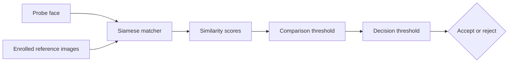
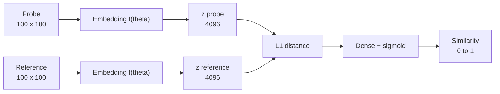
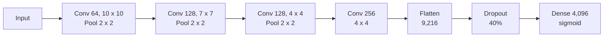
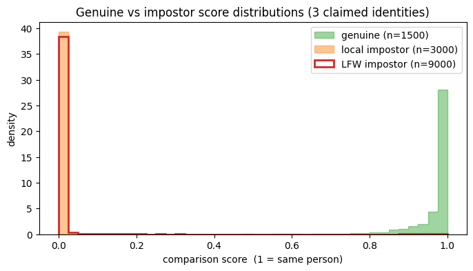
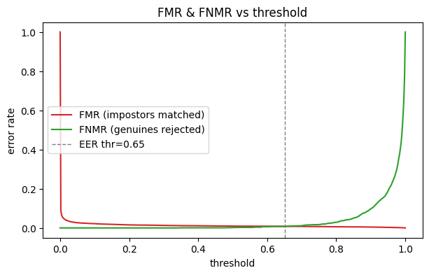
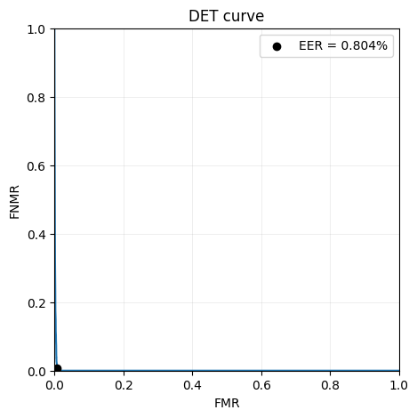
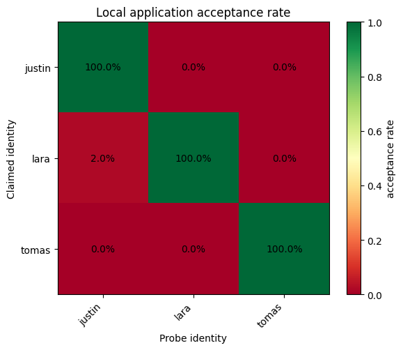

# Siamese Face Verification

Face-verification project for *Introduction to Biometrics*. It trains a Siamese convolutional network, evaluates it with biometric error measures, and provides a small webcam application for live inference and testing. The implementation began with Nicholas Renotte's tutorial and was extended.

This project is split into two parts:
- a notebook for training and evaluating the model
- a verification app to test the shipped model with live inference.

| Jump to | Description |
|---|---|
| [Background](#background) | Purpose, system overview, evaluation, and limitations |
| [Model architecture](#model-architecture) | Siamese network and shared embedding layers |
| [Results and interpretation](#results-and-interpretation) | Final metrics, plots, and interpretation |
| [Reproduce the Notebook](#reproduce-the-notebook) | Set up and run the notebook |
| [Enroll and train a new model](#enroll-and-train-a-new-model) | Capture data and retrain the matcher |
| [Run the verification app](#run-the-verification-app) | Start the live webcam app |

---

## Tutorial extensions

Renotte's code and video series [2] are the implementation starting point. This project changes/improves:

- **multi identity enrollment** is possible, cross-person impostor pairs are used for training;
- **model evaluation** to catch issues like overfitting or poor performance early;
- **extended biometric error evaluation**: genuine/impostor histograms, FMR, FNMR, DET, EER, d-prime, FAR, FRR, ROC-AUC, confusion counts, and inference latency;
- LFW identities split before sampling so test impostors are not represented in the training-impostor pool;
- deterministic sampling, versioned models, pinned dependencies, CPU-safe execution, and Git LFS model delivery;
- compatibility updates for current TensorFlow/Keras, a corrected `2 x 2` first pooling window, and more responsive webcam capture.

The notebook also explains changes beside the relevant code and displays outputs.

## Background

Biometric **verification** asks whether a probe belongs to a claimed identity. It differs from identification, which searches for an identity across many enrolled people. Here, both face images pass through the same convolutional embedding network. Their embeddings are compared with an absolute L1 distance layer, and a sigmoid output produces a similarity score from 0 to 1. Higher scores mean “more likely the same person.”

The data for this project combines local face recordings with an external impostor dataset. I enrolled and recorded three people locally; for each person, separate images are captured for training and held-out verification. Genuine training pairs therefore contain two recordings of the same enrolled person. Impostor pairs use faces from the [Labeled Faces in the Wild (LFW) dataset](https://people.cs.umass.edu/~elm/papers/lfw.pdf) [3], a public collection of face photographs. LFW is used only to represent non-matching faces. Cross-person pairs from the three local recordings also teach the model that enrolled people are different. During verification, one probe is compared with several references for the claimed identity. Each score is thresholded and the comparison decisions are fused into one application-level accept/reject result.



This design follows the supervised metric-learning idea described by Koch, Zemel, and Salakhutdinov [1].

### Model architecture




Embedding network:


> Detailed parameter count can be found in the notebook.

### Training Data

Impostor source: **LFW**, 13,233 images of 5,749 identities, split by identity into 70% train / 15% test / 15% verification partitions (4,024 / 862 / 863 identities) so no LFW identity appears in more than one role.

Genuine identity recordings:

| Person | Capture sessions |
|---|-:|
| justin | 7 |
| lara | 1 |
| tomas | 1 |

Data split:

| Split | Genuine | Cross-person impostor | vs-LFW impostor | Total pairs |
|-------|---:|---:|---:|---:|
| Train | 3,000 (1,000/person, anchor×positive) | 1,500 | 1,500 | 6,000 |
| Test  | 900 (300/person, verification×anchor) | 450 | 450 | 1,800 |

### Basic Model evaluation

This is a supporting model sanity check, not the primary biometric evaluation.

| Split | Pairs | Accuracy | Precision | Recall | F1 | ROC-AUC |
|---|---:|---:|---:|---:|---:|---:|
| Train | 6,000 | 0.996 | 0.995 | 0.997 | 0.996 | 1.000 |
| Held-out test | 1,800 | 0.995 | 0.993 | 0.997 | 0.995 | **1.000** |

Accuracy train-test gap: **0.1 percentage points**. The small gap supports similar performance on these pair splits, but does not remove the session and population limitations described below.

## Biometric error evaluation design

The evaluation is done on two levels:

| Level | Unit | Measures | Question answered |
|---|---|---|---|
| Comparison | One probe-reference score | FMR, FNMR, DET, EER, d-prime | How well does the matcher separate genuine and impostor comparisons? |
| Application | One fused accept/reject claim | FAR, FRR | How well does the complete threshold-and-fusion policy behave? |

## Results and interpretation

### Evaluation configuration

| Configuration                                        | Final value |
|------------------------------------------------------|---:|
| Model                                                | `siamesemodel_20260718_155249.keras` |
| Training run                                         | 35 epochs; 28 min 7.5 s |
| Evaluation device                                    | Apple M3 Pro GPU, 18 GB memory |
| Enrolled / claimed identities                        | 3 (`justin`, `lara`, `tomas`) |
| Training pairs                                       | 3,000 genuine + 3,000 impostor pairs |
| Test Pairs                                           | 900 genuine + 900 impostor pairs |
| Reference images per claim                           | 10 |
| Genuine / local-impostor / LFW-impostor transactions | 150 / 300 / 900 |
| Comparison threshold, `MATCH_THR`                    | 0.5 |
| Decision threshold, `DECISION_THR`                   | 0.6 |

### Primary biometric results

| Level | Result | Final value |
|---|---|---:|
| Comparison | Genuine / impostor comparison scores | 1,500 / 12,000 (3,000 local + 9,000 LFW) |
| Comparison | EER at approximate threshold | **1.054%** at **0.794** |
| Comparison | d-prime | **11.038** |
| Comparison | FMR at `MATCH_THR=0.5` | **1.650% (198/12,000)** |
| Comparison | FNMR at `MATCH_THR=0.5` | **0.000% (0/1,500)** |
| Application | Pooled FAR | **0.917% (11/1,200)** |
| Application | Local-impostor FAR | 0.333% (1/300) |
| Application | LFW-impostor FAR | 1.111% (10/900) |
| Application | Pooled FRR | **0.000% (0/150)** |
| Performance | Model-only 10-reference inference, per-identity median / p95 range | **16.42–16.51 / 17.11–17.43 ms** |
| Performance | Model-only 1:1 comparison, median / p95 | 5.92 / 7.01 ms |

The timing benchmark covers model inference after image preprocessing. It is not end-to-end webcam or API latency; report the device and the number of reference comparisons with it.

### Per-identity application results

This table is important for the multi-subject evaluation: pooled rates alone can hide one identity performing much worse than the others.

| Claimed identity | Genuine transactions | Local / LFW impostor transactions | FRR | Local FAR | LFW FAR | Combined FAR |
|---|---:|---:|---:|---:|---:|---:|
| `justin` | 50 | 100 / 300 | 0.000% (0/50) | 0.000% (0/100) | 3.333% (10/300) | 2.500% (10/400) |
| `lara` | 50 | 100 / 300 | 0.000% (0/50) | 1.000% (1/100) | 0.000% (0/300) | 0.250% (1/400) |
| `tomas` | 50 | 100 / 300 | 0.000% (0/50) | 0.000% (0/100) | 0.000% (0/300) | 0.000% (0/400) |

### Plots


| Score distributions | Error rates by threshold |
|---|---|
|  |  |
| **Figure 1.** Genuine and impostor comparison-score distributions. | **Figure 2.** FMR and FNMR across comparison thresholds, including their approximate EER intersection. |

| DET curve                                                                   | Per-identity acceptance matrix                                                                          |
|-----------------------------------------------------------------------------|---------------------------------------------------------------------------------------------------------|
|  |  |
| **Figure 3.** Detection error trade-off across thresholds (linear).         | **Figure 4.** Application acceptance rate for every claimed identity combination.                       |

### Interpretation

The held-out test metrics remain close to the training metrics: accuracy decreases from 0.996 to 0.995, while precision, recall, and F1 are also within 0.002.

Figure 1 shows the main reason for the strong metrics: genuine comparison scores are concentrated close to 1, while both local and LFW impostor scores are concentrated close to 0. At the fixed comparison threshold of 0.5, 198 of 12,000 impostor comparisons are incorrectly matched, while none of the 1,500 genuine comparisons are incorrectly rejected. The large d-prime of 11.038 shows the strong separation between the distributions, but it should not be read as proof that their tails are harmless.

The fixed threshold of 0.5 is lower than the approximate EER threshold of 0.794. Consequently, its FMR of 1.650% is higher than its FNMR of 0.000%: the chosen operating point favors accepting genuine users at the cost of more impostor matches. The EER of 1.054% is retained as a compact summary of the matcher trade-off; its threshold is not used by the application. Figure 2 shows that increasing the threshold would reduce FMR but increase FNMR.

At application level, each probe is compared with ten references and accepted when at least six comparisons match. All 150 genuine transactions are accepted, giving an observed FRR of 0.000%. One of the 300 local-impostor transactions and 10 of the 900 LFW-impostor transactions are falsely accepted, resulting in a pooled FAR of 0.917%, a local-impostor FAR of 0.333%, and an LFW-only FAR of 1.111%.

The errors are not evenly distributed across claims. Ten of the eleven false accepts occur when an LFW face claims `justin`; the remaining false accept occurs when a local `justin` probe claims `lara`, and none occurs for `tomas`. Figure 4 shows a perfect diagonal and one non-zero off-diagonal cell: 2.0% of local `justin` probes are accepted when claiming `lara`.

A ten-reference model inference has a per-identity median between 16.42 and 16.51 ms; the highest measured p95 is 17.43 ms. This illustrates that model inference is responsive and usable.

Overall, the final model performs well as a three-person demonstration under the conditions: it has strong score separation, no observed genuine transaction rejection, and one observed local cross-person false acceptance.

### Limitations

- **Session overfitting inflates the reported metrics.** Train and test images of a person come from the same capture sessions (for some people a single sitting), so "held-out" probes are near-duplicate frames sharing lighting, background, clothing, and camera position with training images. The model may partly learn session similarity instead of identity, which could help explain why near-perfect test scores do not always transfer to fresh live captures with new lighting, glasses, or a haircut.
  - Later capture sessions of me (`justin`) varied clothing, hairstyle, environment, and lighting. Informal live testing suggested a small improvement, but this was not measured in the reported evaluation.
- Training, pair-test, and operational LFW impostors use disjoint LFW identity partitions. This prevents LFW identity reuse, but it does not remove the larger capture-source difference between local genuine images and LFW impostors.
- The experiment did not address demographic fairness, attack resistance, long-term stability, or production readiness.
- Face detection/alignment failures are not evaluated.

---

## Repository layout

```text
app/backend/                         inference API
app/frontend/                        webapp for webcam interface
data/<person>/verification/          committed reference galleries the app enrolls
data/test_probes/                    staged probe images shown in the app
evaluation/                          plot images
models/                              versioned model files via Git LFS
notebooks/facial-verification.ipynb  training, evaluation, plots, interpretation
requirements.txt                     pinned notebook dependencies
requirements.lock.txt                complete reproducible Python environment
```

---

## Reproduce the notebook

The repo does not come with data of enrolled people, you can capture your own and retrain a new model or look at the existing outputs from the notebook.
The data shipped is to support the verification app.

> The notebook was only tested on MacBooks (Apple Silicon, and Intel with CPU only)

### Prerequisites

- Python 3.11; the project is pinned with **3.11.15** 
- Git LFS for the pretrained model
- At least 2 GB free storage
- Webcam only if collecting new images

### Setup
```bash
# repo setup
git lfs install
git clone https://gitlab.rz.htw-berlin.de/s0583511/biometrics.git
cd biometrics
git lfs pull #!important! if you want to use the pretrained model
```

```bash
# Python environment setup
python -m venv .venv
source .venv/bin/activate
python -m pip install --upgrade pip
python -m pip install -r requirements.lock.txt
python -m ipykernel install --user --name biometrics --display-name "Python (biometrics)"
jupyter lab notebooks/facial-verification.ipynb
```

CPU is the reproducible default. GPU support is opt-in:

```bash
# Optional Apple Silicon GPU
source .venv/bin/activate
python -m pip install tensorflow-metal==1.2.0
USE_GPU=1 jupyter lab notebooks/facial-verification.ipynb
```

Restart the kernel after changing device configuration. If Metal fails, restart without `USE_GPU=1`.

## Enroll and train a new model

1. In the notebook, set `PERSON` to the new person's identifier and enable `CAPTURE`.
2. Capture `anchor (a)` , `positive (p)`, and `verification (v)`
3. set `CAPTURE = False` and `TRAIN = True` and run the notebook from top to bottom

---

## Run the verification/inference webapp

The app performs 1:1 verification: pick a **claimed identity**, then present a probe (webcam capture, an uploaded image, or a staged test probe). 

### Data the app needs

> Demo verifications and probes for a few people are committed so the app runs out of the box;

The app reads enrolled people directly from `data/`:

```text
data/<person>/verification/*.jpg   reference gallery for each enrolled person
data/manual_test/*.jpg             staged probe images, shown as clickable thumbnails
```

- A person is selectable when `data/<person>/verification/` holds at least one `.jpg`; the dropdown lists these people. To enroll someone, drop their reference images into that folder.
- `data/manual_test/` holds probe images rendered as a thumbnail grid; click one to verify it against the selected identity.


### Run the webapp:

```bash
# with docker installed:
docker compose up --build
```

or

```bash
# with Node.js and Python installed
source .venv/bin/activate
python -m pip install -r app/backend/requirements.txt
cd app/frontend && npm ci && cd ../..
./app/start.sh
```

Open <http://localhost:5173>. 

## References

1. G. Koch, R. Zemel, and R. Salakhutdinov, “Siamese Neural Networks for One-shot Image Recognition,” 2015. [Author-hosted paper](https://www.cs.cmu.edu/~rsalakhu/papers/oneshot1.pdf).
2. N. Renotte, *FaceRecognition*. [Original repository](https://github.com/nicknochnack/FaceRecognition) and [tutorial playlist](https://www.youtube.com/watch?v=bK_k7eebGgc&list=PLgNJO2hghbmhHuhURAGbe6KWpiYZt0AMH).
3. G. B. Huang, M. Ramesh, T. Berg, and E. Learned-Miller, “Labeled Faces in the Wild: A Database for Studying Face Recognition in Unconstrained Environments,” UMass Amherst Technical Report 07-49, 2007. [Institution-hosted paper](https://people.cs.umass.edu/~elm/papers/lfw.pdf).
4. G. B. Huang and E. Learned-Miller, “Labeled Faces in the Wild: Updates and New Reporting Procedures,” UMass Amherst Technical Report UM-CS-2014-003, 2014. [Institution-hosted paper](https://people.cs.umass.edu/~elm/papers/lfw_update.pdf).
5. A. K. Jain, A. A. Ross, K. Nandakumar, and T. Swearingen, *Introduction to Biometrics*, 2nd ed. Springer, 2024. [Publisher record and DOI](https://doi.org/10.1007/978-3-031-61675-4).
6. A. Jha, “LFW People (Face Recognition),” Kaggle mirror used by `kagglehub`. [Download page](https://www.kaggle.com/datasets/atulanandjha/lfwpeople). Dataset provenance and protocol are cited from [3] and [4].
7. Knaut, “Enhanced Training & Testing,” *Advanced Topics: Introduction to Biometrics*, HTW Berlin, SoSe 2026, course slides.

### AI-assisted development & writing

AI coding assistants (Claude Code and OpenAI Codex) were used during development for prototyping, refactoring, boilerplate, research and writing. All AI-suggested code/writing was reviewed, tested, and adapted by me, and I take full responsibility for the final implementation.
