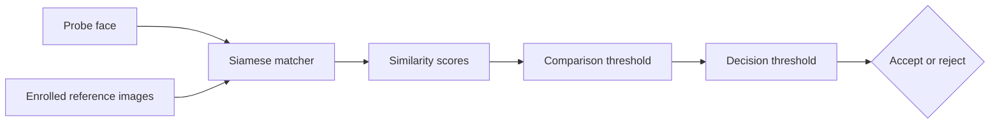

# Siamese Face Verification

Face-verification project for *Introduction to Biometrics*. It trains a Siamese convolutional network, evaluates it with biometric error measures, and provides a small webcam application for live inference and testing. The implementation began with Nicholas Renotte's tutorial and was extended.

This project is split into two parts:
- a notebook for training and evaluating the model
- a verification app to test the shipped model with live inference.

| Jump to | Description |
|---|---|
| [Background](#background) | Purpose, system overview, evaluation, and limitations |
| [Reproduce the Notebook](#reproduce-the-notebook) | Set up and run the notebook |
| [Enroll and train a new model](#enroll-and-train-a-new-model) | Capture data and retrain the matcher |
| [Run the verification app](#run-the-verification-app) | Start the live webcam app |

---

## Background

Biometric **verification** asks whether a probe belongs to a claimed identity. It differs from identification, which searches for an identity across many enrolled people. Here, both face images pass through the same convolutional embedding network. Their embeddings are compared with an absolute L1 distance layer, and a sigmoid output produces a similarity score from 0 to 1. Higher scores mean “more likely the same person.”

The data for this project combines local face recordings with an external impostor dataset. I enrolled and recorded three people locally; for each person, separate images are captured for training and held-out verification. Genuine training pairs therefore contain two recordings of the same enrolled person. Impostor pairs use faces from the [Labeled Faces in the Wild (LFW) dataset](https://people.cs.umass.edu/~elm/papers/lfw.pdf) [3], a public collection of face photographs. LFW is used only to represent non-matching faces. Cross-person pairs from the three local recordings also teach the model that enrolled people are different. During verification, one probe is compared with several references for the claimed identity. Each score is thresholded and the comparison decisions are fused into one application-level accept/reject result.



This design follows the supervised metric-learning idea described by Koch, Zemel, and Salakhutdinov [1].

## What changed from the tutorial

Renotte's code and video series [2] are the implementation starting point. This project changes/improves:

- **multi identitiy enrollment** is possible, cross-person impostor pairs are used for training;
- **model evaluation** to catch issues like overfitting or poor perfomance early;
- **extended biometric error evauluation**: genuine/impostor histograms, FMR, FNMR, DET, EER, d-prime, FAR, FRR, ROC-AUC, confusion counts, and inference latency;
- LFW identities split before sampling so test impostors are not represented in the training-impostor pool;
- deterministic sampling, versioned models, pinned dependencies, CPU-safe execution, and Git LFS model delivery;
- compatibility updates for current TensorFlow/Keras, a corrected `2 x 2` first pooling window, and more responsive webcam capture.

The notebook also explains changes beside the relevant code.

## Biometric error evauluation design

The evaluation is done on two levels:

| Level | Unit | Measures | Question answered |
|---|---|---|---|
| Comparison | One probe-reference score | FMR, FNMR, DET, EER, d-prime | How well does the matcher separate genuine and impostor comparisons? |
| Application | One fused accept/reject claim | FAR, FRR | How well does the complete threshold-and-fusion policy behave? |


## Results and interpretation

| Result | Final value |
|---|---:|
| Held-out personalized test ROC-AUC | TBD |
| EER / EER threshold | TBD / TBD |
| d-prime | TBD |
| FMR / FNMR at selected threshold | TBD / TBD |
| Application-level FAR / FRR | TBD / TBD |
| Median / p95 application-level latency | TBD / TBD ms |

Use the following evidence chain for the final interpretation:

1. **Held-out performance:** report test ROC-AUC and the train-test gap. The test uses new captures of the locally captured identities and LFW impostor identities excluded from training; it does not establish genuine matching for people absent from training. Do not treat accuracy at an arbitrary 0.5 threshold as a security guarantee.
2. **Score separation:** compare genuine and impostor centers, overlap, tails, and outliers. Relate these observations to d-prime without assuming the distributions are perfectly Gaussian.
3. **Operating point:** report FMR and FNMR with error counts at the selected threshold. Explain whether the choice prioritizes avoiding impostor matches or avoiding genuine-user rejection. Raising the threshold should reduce the former and increase the latter.
4. **DET and EER:** report EER and its approximate threshold, then explain why the selected operating threshold does or does not differ. EER is a summary, not a deployment recommendation.
5. **End-to-end decision:** report the number of references, both thresholds, fusion rule, FAR, and FRR. Keep these application-level rates distinct from comparison-level FMR/FNMR.
6. **Practicality and limits:** interpret median and p95 latency on the recorded device. Bound all conclusions to the sampled data and configuration.

Suggested final conclusion structure:

> The evaluation contained **TBD genuine** and **TBD impostor** comparisons. At comparison threshold **TBD**, FMR was **TBD (errors/trials)** and FNMR was **TBD (errors/trials)**. The EER of **TBD** and d-prime of **TBD** indicate **TBD about score separation**. After fusing **TBD** reference comparisons, application-level FAR was **TBD** and FRR was **TBD**. Median application-level latency was **TBD ms** on **TBD hardware**. These results support **TBD**, within the limitations below.


- also i changed tshirts/haircut/envrionment&lightning this made it harder so i had record more diverse data

### Limitations

- The locally captured genuine set is small, while impostors come from LFW; camera, crop, and background differences may partly separate the two groups.
- The matcher is specialized for the locally recorded identities. It is not evidence of a general face representation that can verify a completely unseen person without retraining.
- Training, pair-test, and operational LFW impostors use disjoint LFW identity partitions. This prevents LFW identity reuse, but it does not remove the larger capture-source difference between local genuine images and LFW impostors.
- Many comparisons reuse probes or references, so the number of scores is larger than the number of independent people or application-level decisions.
- A measured zero-error rate means only zero observed errors in a finite sample. Always report `errors / trials`; do not infer population-level security.
- The experiment did not adress demographic fairness, attack resistance, long-term stability, or production readiness.
- Face detection/alignment failures are not evaluated.

---

## Repository layout

```text
notebooks/facial-verification.ipynb  training, evaluation, plots, interpretation
models/                              versioned model files via Git LFS
app/backend/                         inference API
app/frontend/                        webapp for webcam interface
data/<person>/verification/          committed reference galleries the app enrolls
data/test_probes/                    staged probe images shown in the app
requirements.txt                     pinned notebook dependencies
requirements.lock.txt                complete reproducible Python environment
```

---

## Reproduce the notebook

The repo does not come with data of enrolled people, you can capture your own and retrain a new model or look at the exiting outputs from the notebook.
The data shipped is to support the verification app.

> The notebook was only tested on a MacBook with an Apple Silicon Chip

### Prerequisites

- Python 3.11; the project is pinned with **3.11.15** 
- Git LFS for the pretrained model
- approximately 1 GB free for the LFW download and extraction
- a webcam only if collecting new enrollment/probe images

### Setup
```bash
# repo setup
git lfs install
git clone https://gitlab.rz.htw-berlin.de/s0583511/biometrics.git
cd biometrics
git lfs pull #!important! if you want to use the pretrained model
```

```bash
# Python environment setup
python -m venv .venv
source .venv/bin/activate
python -m pip install --upgrade pip
python -m pip install -r requirements.lock.txt
python -m ipykernel install --user --name biometrics --display-name "Python (biometrics)"
jupyter lab notebooks/facial-verification.ipynb
```

CPU is the reproducible default. GPU support is opt-in:

```bash
# Optional Apple Silicon GPU
source .venv/bin/activate
python -m pip install tensorflow-metal==1.2.0
USE_GPU=1 jupyter lab notebooks/facial-verification.ipynb
```

Restart the kernel after changing device configuration. If Metal fails, restart without `USE_GPU=1`.

## Enroll and train a new model

1. In the notebook, set `PERSON` to the new person's identifier and enable `CAPTURE`.
2. Capture `anchor (a)` , `positive (p)`, and `verification (v)`
3. set `CAPTURE = False` and `TRAIN = True` and run the notebook from top to bottom

---

## Run the verification/inference webapp

The app performs 1:1 verification: pick a **claimed identity**, then present a probe (webcam capture, an uploaded image, or a staged test probe). 

### Data the app needs

> Demo verifications and probes for a few people are committed so the app runs out of the box;

The app reads enrolled people directly from `data/`:

```text
data/<person>/verification/*.jpg   reference gallery for each enrolled person
data/manual_test/*.jpg             staged probe images, shown as clickable thumbnails
```

- A person is selectable when `data/<person>/verification/` holds at least one `.jpg`; the dropdown lists these people. To enroll someone, drop their reference images into that folder.
- `data/manual_test/` holds probe images rendered as a thumbnail grid; click one to verify it against the selected identity.


### Run the webapp:

```bash
# with docker installed:
docker compose up --build
```

or

```bash
# with Node.js and Python installed
source .venv/bin/activate
python -m pip install -r app/backend/requirements.txt
cd app/frontend && npm ci && cd ../..
./app/start.sh
```

Open <http://localhost:5173>. 

## References

1. G. Koch, R. Zemel, and R. Salakhutdinov, “Siamese Neural Networks for One-shot Image Recognition,” 2015. [Author-hosted paper](https://www.cs.cmu.edu/~rsalakhu/papers/oneshot1.pdf).
2. N. Renotte, *FaceRecognition*. [Original repository](https://github.com/nicknochnack/FaceRecognition) and [tutorial playlist](https://www.youtube.com/watch?v=bK_k7eebGgc&list=PLgNJO2hghbmhHuhURAGbe6KWpiYZt0AMH).
3. G. B. Huang, M. Ramesh, T. Berg, and E. Learned-Miller, “Labeled Faces in the Wild: A Database for Studying Face Recognition in Unconstrained Environments,” UMass Amherst Technical Report 07-49, 2007. [Institution-hosted paper](https://people.cs.umass.edu/~elm/papers/lfw.pdf).
4. G. B. Huang and E. Learned-Miller, “Labeled Faces in the Wild: Updates and New Reporting Procedures,” UMass Amherst Technical Report UM-CS-2014-003, 2014. [Institution-hosted paper](https://people.cs.umass.edu/~elm/papers/lfw_update.pdf).
5. A. K. Jain, A. A. Ross, K. Nandakumar, and T. Swearingen, *Introduction to Biometrics*, 2nd ed. Springer, 2024. [Publisher record and DOI](https://doi.org/10.1007/978-3-031-61675-4).
6. A. Jha, “LFW People (Face Recognition),” Kaggle mirror used by `kagglehub`. [Download page](https://www.kaggle.com/datasets/atulanandjha/lfwpeople). Dataset provenance and protocol are cited from [3] and [4].
